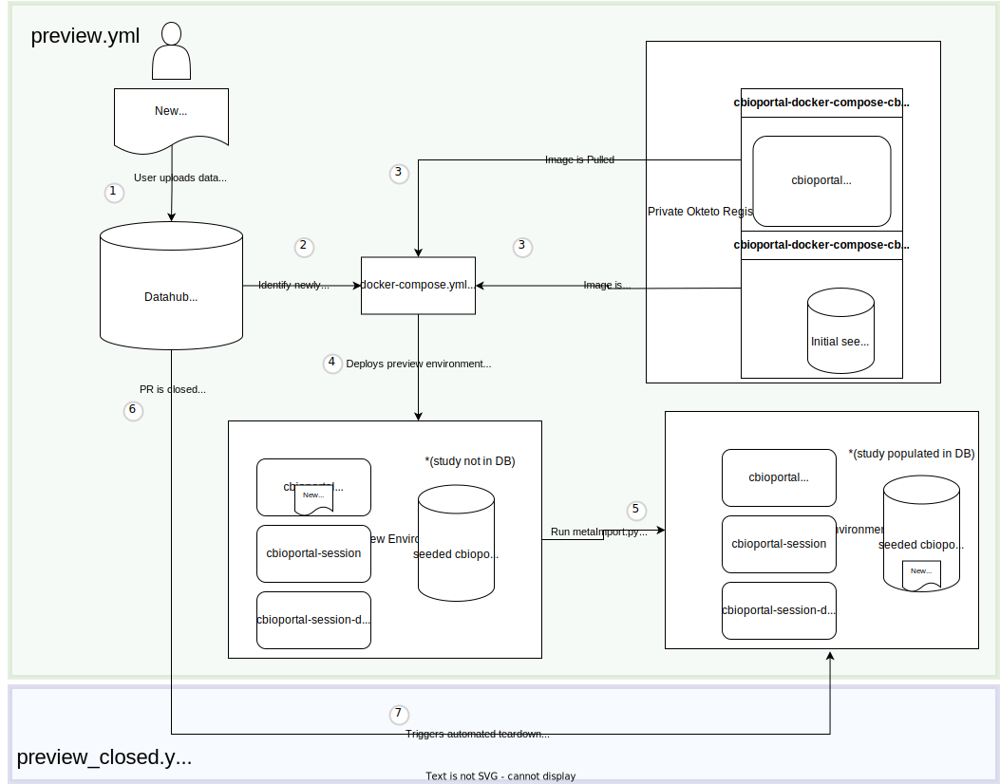

# Google Summer of Code 2023 Final Submission Report

Contributor: Justin Jao

Mentors: Charles Haynes, Walle, Avery Wang

Project: [Automating Quality Control of Datahub Submissions](https://summerofcode.withgoogle.com/programs/2023/projects/NH758ApJ)

## Project Background & Goals

This Google Summer of Code project targets the issue identified [here](https://github.com/cBioPortal/GSoC/issues/84).

The Datahub repository contains various open source data that can be imported into the cBioPortal web application. As part of the concerted effort to leverage open-source collaboration across the cancer research community, users are freely able to [upload their own own data](https://docs.cbioportal.org/data-loading/#data-loading) by following a specified format. There exists scripts to manually validate the integrity of the dataset. However, verification of how the dataset displays within the web portal itself currently requires a manual step involving a maintainer loading the newly added dataset into a running environment to be able to visually the data, as part of the quality control review process. To automate this requires a live staging instance environment that could:

* automatically trigger to be deployed upon a Pull Request (PR) from any user to the Datahub repository
* automatically load the study into the running instance
* automatically spin down upon PR merge/close

Automating this process presents a substantial quality-of-life improvement for maintainers, allowing data to be more rapidly verified and approved, and improving the quality of cancer research that can be visualized within cBioPortal.

## Brief Summary of Coding Period Activity

**May - June**

I primarily spent the first few months familiarizing and re-acquainting myself with the technology necessary for the project, (`docker-compose`, GitHub Actions, etc.). I also explored the cBioPortal ecosystem  (`datahub`, `cbioportal-docker-compose`, `cbioportal`, and `cbioportal-frontend` repositories), and running them to understand the applications I would be deploying.

**End June to Mid July**
I spent much of this phase discussing potential solutions with my mentors for creating our desired workflow, and what the final architecture was that we wanted to arrive at. As part of this phase, I spent time exploring potential solutions such as utilizing Terraform and AWS infrastructure, as well as Okteto, to deploy our preview environment, deploying test applications to see Proof of Concepts, before ultimately settling on Okteto due to its fully managed infrastructure and potential ease of use.

**Mid July to Early September**
This was the main coding phase of the project, where I actually implemented the code and tested the workflow. I first designed a workflow to prove that I could utilize Okteto to deploy an actual instance of cBioPortal. Afterwards, I modified the workflow to detect newly detected studies, and import multiple studies into the database. This phase involved numerous sessions of debugging, reaching out to mentors and others in the Okteto Community.

Finally, I produced documentation detailing the proposed workflow solution I came up with.

## Produced Solution

The draft PR containing the work performed, the proposed workflow and the documentation can be found [here](https://github.com/cBioPortal/datahub/pull/1909) https://github.com/cBioPortal/datahub/pull/1909.

**As of the submission time of this report, the most up-to-date commit is: *bc8bf2a* (Add documentation files)**

> Note that due to the nature of my project (testing GitHub actions workflow), I had to create multiple different test branches, and repeated commits to test out changes. As a result, for clarity, I have simply created a new branch from scratch with the finalized version for review.

The finalized solution produced is a fully functional workflow that triggers a deploy of a staging environment upon PR creation to the datahub repo, and automatically tears it down upon PR closure/merging. The overall workflow is depicted in the following image:

The proposed workflow (`preview.yml`) works by pulling pre-built images of cBioPortal and the cBioPortal SQL database from a private Okteto registry. These images are used to launch a preview environment with the new studies imported as well, using Okteto's `Deploy Preview` action. Upon which, a `metaImport.py` script can be run to import the study into the running application instance. When a PR is closed, the `preview_closed.yml` workflow is triggered to teardown the deployed environment.

For much more detail into how this was designed, see the `Preview_Overview` file in documentation.

## Remaining & Future Work

This PR has been internally approved. However, there remains certain things that must be clarified and decided upon before it can be fully integrated into production, hence the current draft status of the PR.

### Okteto Account Management
Further discussion is needed to determine how cBioPortal will want to utilize Okteto within their organization. This includes who will be owning and maintaining the Okteto accounts. After such discussion has been undertaken, the initial setup (outlined in documentation) will need to be performed to implement the workflow properly.
### Gene Panel ID Issue
Currently, this workflow does not support adding in all types of studies. When the database is seeded and initialized, only studies with gene panels already present in the database can be added. Further work must be done to automatically add the gene panel ID for new studies if necessary, so that studies can be correctly imported.

### Automated Rebuilding of cBioPortal Image
Currently, the cBioPortal build version is frozen at whatevever the most current build is when the initial setup was performed. Thus, when a newer version is desired, certain steps in the initial setup (outlined in the documentation under `Preview_Setup`) must be performed. The overhead for this has been mitigated by writing the commands into a bash script. However, future work could look into linking this with updates to the `cbioportal-docker-compose` repo, so that the `datahub` repo is updated in lock-step with the `cbioportal` build version updates, so that this never needs to be run manually.

### Further Automation
One of the initial goals after the deployment was finished was to potentially look into other automation that could be performed (e.g. certain UI testing, or screenshots taken of the deployed instance) to further ease the review process. This is something that could be further explored as well.

## Some Personal Reflection and Discussion
I learned a lot over the past summer, and what I thought would be a fairly straightforward project with technology I was somewhat familiar with turned into a surprisingly complex (and at times frustrating) project. There were several highlights of things I came to realize:

### Technical Learning
First and foremost, I learnt a lot on the technical side about deploymenets and infrastructure related projects, particularly within GitHub's internal infrastructure. Containerization, staging environments and bash scripting were all tools that I was familiar with in passing, but that I felt I really got a chance to practice with over the course of this project, and I'm sure this will serve me well in many future development projects.

### Documentation is Much More Important Than I Realized
One of the key frustrations I had with this project was working with a tool (Okteto) that both I (and the rest of my team) was unfamiliar with. Because I was learning it from scratch, I really needed to rely on documentation to guide me on how to use the tool effectively. However (possibly because the tool was new and being developed rapidly), I often found very sparse documentation, or articles that were ambigiously out of date. This project really made me realize how crucial it is to have good documentation for any software product.

### Close Feedback Loops Faster
This is a lesson I've been taught before, but I feel that I really experienced the value of this throughout the project, both on a technical basis - i.e. learning to break issues down into simpler debugging steps, or PoC examples, as well as on a personal level, i.e. reaching out earlier to my mentors, as well as others in the Okteto community. There came several points where I felt like I had to figure out everything on my own because of how long I was taking to solve things, but ultimately what helped me solve things the fastest was being able to get feedback on my progress/approach, so that I could pivot if needed.

Overall, I'm really glad I got to work on this project over the summer, as I learned a lot about things I thought I already knew. And of course, the chance to contribute to cancer research again, and to work on a project in life sciences again (having come from a life science background) was an opportunity that speaks close to my heart, and is one that I appreciated greatly.